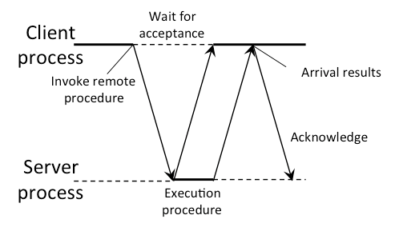
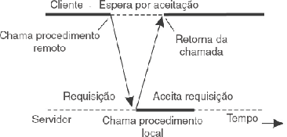
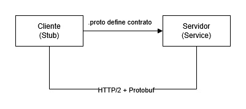

# gRPC – Visão Geral

**gRPC** (Google Remote Procedure Call) é um framework open-source de comunicação remota de alta performance, criado pelo Google e mantido pela CNCF. Ele é usado para conectar diferentes aplicações e microsserviços de forma extremamente rápida e leve. Ele utiliza o modelo de comunicação RPC.
O ponto forte dele é permitir a conexão em qualquer ambiente e de forma robusta.

---

## O que é RPC?

RPC (*Remote Procedure Call*) é um modelo de comunicação em que um programa chama uma função que está rodando em **outro processo ou máquina**, como se fosse uma chamada local através da rede.
Uma das maiores vantagens do RPC é que pouco importam os detalhes da rede. Como o RPC é uma operação síncrona, ele exige que o programa solicitante (cliente) fique suspenso até que os resultados do procedimento remoto fiquem prontos e sejam retornados pelo servidor.

<b>Figura 1:</b> Exemplo de Comunicação com RPC síncrono

<b>Figura 2:</b> Exemplo de Comunicação com RPC assíncrono

<b>Autor:</b> Tanenbaum e Steen, 2007.

O gRPC moderniza esse conceito usando:

- **Protobuf** como formato de serialização (substitui JSON/XML)
- **HTTP/2** como protocolo de transporte (substitui HTTP/1.1)

---

## Por que usar gRPC?

A ideia do gRPC é ser mais rápido que o REST tradicional. Mas como ele faz isso?
No HTTP/1.1, a comunicação costuma usar texto plano, criando pacotes de dados mais pesados. O gRPC utiliza HTTP/2 e codifica as mensagens em formato binário, naturalmente mais leve que o formato textual. Ele faz isso por meio de outra ferramenta chamada **Protobuf**, que define como um sistema espera receber as mensagens de outro sistema.

| Característica | REST/JSON | gRPC/Protobuf |
|---|---|---|
| Serialização | JSON (texto) | Binário (protobuf) |
| Protocolo | HTTP/1.1 | HTTP/2 |
| Streaming | ❌ Limitado | ✅ Nativo (4 tipos) |
| Tipagem | Fraca (JSON) | Forte (.proto) |
| Performance | Moderada | Alta |
| Contrato de API | OpenAPI/Swagger | `.proto` file |

---

## Componentes principais

<b>Figura 3:</b> Exemplo de Comunicação com gRPC

<b>Autor:</b> <a href="https://github.com/gabrielfreitass1">Gabriel Freitas</a>, 2026.
 

- **`.proto` file** — define os serviços e mensagens (contrato da API)
- **Stub (cliente)** — código gerado automaticamente que o cliente usa para chamar o servidor
- **Service (servidor)** — implementação dos métodos definidos no `.proto`
- **Protobuf** — mecanismo de serialização binária
- **HTTP/2** — protocolo de transporte com suporte a multiplexação e streaming

---

!!! info "Continue lendo"
    - [Protobuf em detalhes →](protobuf.md)
    - [HTTP/2 em detalhes →](http2.md)
    - [Os 4 tipos de comunicação →](tipos-comunicacao.md)
    - [Exemplos e testes realizados →](exemplos.md)

## Fontes
>https://www.youtube.com/watch?v=F4t3ZBVMlvo&t=31s

>https://grpc.io/docs/what-is-grpc/introduction/

## Histórico de Versão
| Versão | Data       | Descrição                                      | Autor               | Revisor               |
|--------|------------|------------------------------------------------|---------------------|-----------------------|
| 1.0    | 04/06/2026 | Primeira versão do artefato gRPC | [Milena Baruc Rodrigues Morais](https://github.com/MilenaBaruc) | [Milena Baruc Rodrigues Morais](https://github.com/MilenaBaruc) |
| 1.1    | 06/06/2026 | Atualização das imagens e de algumas descrições | [Gabriel Freitas Balbino](https://github.com/gabrielfreitass1) | [Gabriel Freitas Balbino](https://github.com/gabrielfreitass1) |
