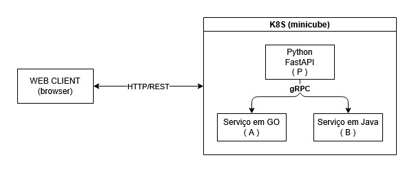

# Kubernetes – Visão Geral

O Kubernetes (também conhecido como K8s) é uma plataforma de código aberto para orquestrar e gerenciar aplicações em contêineres. Ele automatiza tarefas manuais como a implantação, o dimensionamento (escala) e a operação de sistemas distribuídos, garantindo que suas aplicações rodem com alta disponibilidade e eficiência.

## Como o Kubernetes Funciona?
- Orquestração de Contêineres: Enquanto ferramentas como o Docker criam contêineres individuais, o Kubernetes coordena milhares deles para trabalharem juntos, distribuindo a carga de trabalho de forma inteligente.
- Auto-recuperação (Self-healing): Se um contêiner travar, o Kubernetes reinicia, substitui ou programa a remoção automaticamente.
- Escalabilidade Automática: Ele aumenta ou diminui o número de instâncias de uma aplicação com base no tráfego ou na demanda por processamento.
- Descoberta de Serviço e Balanceamento: Ele atribui endereços IP exclusivos aos contêineres e um nome DNS único para o grupo, distribuindo o tráfego de forma balanceada.


## Relembrando Arquitetura

<div align="center">
<font size="3"><p style="text-align: center"><b>Figura 1:</b> Arquitetura de Comunicação do projeto</p></font>



<font size="3"><p style="text-align: center"><b>Autor:</b> <a href="https://github.com/gabrielfreitass1">Gabriel Freitas</a>, 2026.</p></font> 
</div>

## Minikube

O Minikube é uma ferramenta de código aberto que permite executar um cluster Kubernetes de forma rápida e simplificada diretamente na sua máquina local. Ele cria um ambiente virtualizado de nó único (ou multi-nó) que é ideal para desenvolvedores testarem e aprenderem a usar o Kubernetes sem precisar de infraestrutura complexa na nuvem.

## Principais Comandos e Passo a passo

```bash
#1. Conteinizar serviços com Dockfile

#2. Buildar as imagens

#3. Ininiar o ambiente do minikube
minikube start

#4. Carregar as imagens para dentro do minikube
minikube image load <nome-da-imagem>

#5. Criar arquivos de deploy
./k8s/servidor-a.yaml

#6. Fazer o deploy
kubectl apply -f <servidor-a.yaml>

#7. Iniciar o serviço
minikube service stub-api --url 
```
Outros comandos que foram uteis:

```bash
#Ver os pods com seus estados e data de att
kubectl get pods

# Restart em uma imagem
kubectl rollout restart deployment stub-api

# Debugar conteiner(esse aqui é dos deuses)
kubectl logs servidor-a-dc9556f45-n2z97

# Acessar terminal do container
kubectl exec -it servidor-a-6cdd78f57c-k5dmp -- sh                    


# Copiar arquivo de dentro do container
kubectl cp servidor-a-6df4bfd6f9-sphx2:/app/db/db.sqlite3 ./db.sqlite3
```

## Fontes

>https://www.youtube.com/watch?v=oLfxSElZTDk

>https://aws.amazon.com/pt/compare/the-difference-between-kubernetes-and-docker/

>https://kubernetes.io/pt-br/

>https://www.youtube.com/watch?v=pV0nkr61XP8&t=217

>https://minikube.sigs.k8s.io/docs/

## Histórico de Versão
| Versão | Data       | Descrição                                      | Autor               | Revisor               |
|--------|------------|------------------------------------------------|---------------------|-----------------------|
| 1.0    | 14/06/2026 | Primeira versão do artefato k8s| [Gabriel Freitas Balbino](https://github.com/gabrielfreitass1) | [Gabriel Freitas Balbino](https://github.com/gabrielfreitass1) |
